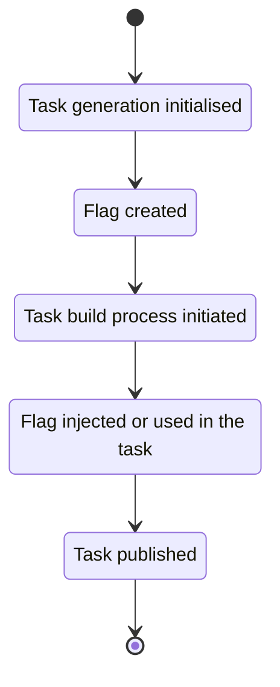

# Grade assistant (Graas)

> **Warning**
> This very work in progress..

## Purpose

This software attempts to build CTF-like tasks with different solutions for students in away, that these solutions can
be automatically reviewed.
GitHub Classroom as platform seems to be the most fit for our usecase; it offers the lowest maintenance and is likely
future-proof.
Because of that, the software will be designed, but not be totally limited, for GitHub ecosystem.

Current design ideas include:

* Students create own repository for making assignments with GitHub Classroom
* After trigger is made (e.g. specific tag is published), GitHub Actions is triggered, and with the help of **this**
  software, possible assigment related files will be generated as releases
    * Files will be either generated as releases under student's own repository, or as package into GitHub
      organisations' container registry
    * Supported tasks will be CTF-like - there needs to be a flag which should be found, or seed is used to generate the
      solution
    * This software will generate unique flag for every student, or either uses unique seed as base for the final
      answer (e.g. pick random password from the list, so that password is different for every student, but selection
      process is reproducible with the original seed.)
    * Uniqueness should be defined based on the repository name, which is combination of the assigment and the GitHub
      username. We don't want to collect personal information.
* Tasks can be based on OCI (Docker) container image, or any binary file. Only requiremenet is the flag, or a use of
  seed to generate the final answer, and it can be shared on GitHub with the limits of free tier.
    * MVP product should be able build container images, Rust, C and Go binaries, and inject flags to them
    * MVP product should be also able to generate student-specific Docker Compose file and related images, if the task
      requires multi-container environment
* Student can provide the answer either in Markdown file or in some structured format (YAML, TOML?)
* Student will push specific tag and then review process is triggered in GitHub Actions (this software will be run to
  see if the flag matches the correct student)

### Things to considerate

On GitHub's free tier, there is not much CI time for private jobs (student's repositories are private).
Also, we might need custom GitHub Actions runner to limit permissions that students can't acquire private keys or
secrets which are used to generate tasks (and flags).
For that purpose, we need to self-host our GitHub Action runners.

* Self-hosted custom runner should be able to use this software as argument
    * Note command-injection and other risk factors which students can control (The can modify `.github` folder while
      they should not)
    * Check, for example, integrity of `.github` files with checksums. Self-hosted runner will only run with valid
      checksums
    * Alternatively, check GPG signature if the commiter in `.github` folder. Self-hosted runner will only allow
      verified commiters to make changes
    * Tips https://github.com/diamondburned/autograde-guard/

Other kind misuse should be prevented

* Do not allow regeneration of the task files
    * Make checks which verify that the first generation was successful, so there is no need for student to initialise
      it again

## Current flag types, and idea of their use

* FlagAsTextFile
* FlagAsBinary (executable)
* FlagAsEnvVariable
* FlagAsRNGSeed



There should be a specific format how tasks can be configured.
Flag type and output files should be defined.
There should be uniform way to tell, how every task will be build.

* It could be oldSchool Makefile (own Makefile for every task? Could take too much effort)
* Some other build system
    * https://github.com/go-task/task
* Just bash command? (dangers ahead)

From the security perspective, GitHub Actions runner should be only able to run this specific binary, but then this
specific binary can give build commands.
Debug mode should be prevented on runner, just in case to not leak too much information.

## Code quality

Software must be written in Go, because all important container related has been build with Go, and we don't want to
increase maintenance effort with third-party wrappers.
GitHub CLI and Graphql engine is also written in Go, which provides as the best way to access GitHub's API, when it is
required.

* Ideal goal is to make future-proof (select stable, well adapted, popular dependencies), low maintenance code
* Task generation should be based on strong cryptography
    * However, if seed must be used and direct flag is not possible, then so be it (might not be secure)
* Follow current best practices of Golang
* Proper testing is important and use formatters to improve code quality
    * https://bitfieldconsulting.com/golang/tdd
    * https://staticcheck.io/
    * If unsure about IDE, GoLand or Fleet will do it

## Current work

Initial remake with cobra and viper has been made.
Example https://github.com/carolynvs/stingoftheviper or Cobra introduction tutorial on docs.

Just basic skeleton with logging and some parameters has been implemented.
Basic idea for flag generation.

### Dependencies

* [Cobra](https://github.com/spf13/cobra) for creating modern CLI applications
* [Viper](https://github.com/spf13/viper/) for reading ENV variables and TOML/YAML files. For all other configuration. (
  Cobra already uses it when generating template code)
    * Apparently v2 is on the way with breaking changes, but might take time to land
    * [pflag](https://github.com/spf13/pflag) for POSIX/GNU flags, Cobra dependency as well
* [Zap](https://github.com/uber-go/zap) as advanced and fast logger

## Potential libraries for future development

* GitHub API access https://github.com/cli/go-gh (Might be needed for at least publishing releases with assests and
  packages)
* Building Containers https://github.com/containers/buildah or https://github.com/GoogleContainerTools/kaniko
    * No root required, we want that. We should also look some cache optimisations to produce one-layer images. Buildah
      is likely better.
* Possibly also some other build tool should be considered for general binaries. For every task, there should be some
  common ground to define building of the binary and extract the output
    * Maybe Task https://github.com/go-task/task
    * Most likely for Go, C and Rust binaries at first
    * Also PDF, .docx generation is possible in the future, very versatile is required
* For parsing Markdown, seems reasonable: https://github.com/gomarkdown/markdown

## Getting started

Continuation of the development requires understanding the following concepts at first:

* GitHub Classroom and
  its [autograding features](https://docs.github.com/en/education/manage-coursework-with-github-classroom/teach-with-github-classroom/use-autograding)
    * This software will be run as part of the autograder
    * Check following samples
        * https://github.com/CompSec-2021/autogradefeaturetesting-Nicceboy/tree/main
        * https://github.com/CompSec-2021/AutoGrader

* How GitHub Actions works. Classroom uses it, but it will be also used on publishing unique tasks for the students (
  releases & packages), maybe something else as well.
    * This software depends on the Actions environment (environment variables, folder structure etc.)
* How OCI containers work
    * It is important to know how layers and everything work, so that we are not appending flag just as final layer
      which is easily extractable
    * Prefer native Go SDK:s of container systems instead of their default clients
    * If we build containers for masses in self-hosted VM, **we need to optimise cache-reuse**
    * Prefer multi-stage builds with one layer if Dockerfile (Containerfile) is used, squash in the end
    * Compare with non-root alternatives [Buildah](https://github.com/containers/buildah)
      or [Kaniko](https://github.com/GoogleContainerTools/kaniko)

### With code

1. Install Go
2. `go build` will install required dependencies
3. `go run main.go` will run the Cobra root command and it will print help text

Simple usage to generate flag for specific task on specific week
Task building or flag embedding not implemented

```cmd
export GITHUB_REPOSITORY="unique/user/repositorynamespace"
go run main.go -ldebug generate -w 1 -t 1
```