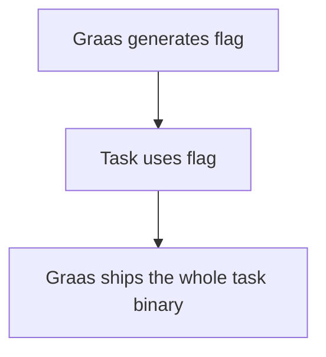

# Grade assistant (Graas)

## Purpose

This software attempts to build CTF-like tasks for students and automatically review them.
After reviewing current possilities, using GitHub Classroom as platform seems to be the most fit, and grants the lowest maintenance and is probably very future-proof.
Because of that, the software will be designed, but not be totally limited, for GitHub ecosystem.

Current design idea includes:
* Students create own repository for making assignments with GitHub Classroom
* After trigger is made (e.g. specific tag is published), GitHub Actions is triggered, and with the help of **this** software, possible assigment related files will be generated as releases
  * Files will be either generated as releases under student's own repository, or as package into GitHub organisations' container registry
  * Supported tasks will be CTF-like - there needs to be a flag which should be found, or seed is used to generate the solution
  * This software will generate unique flag for every student, or either uses unique seed as base for the final answer (e.g. pick random password from the list, so that password is different for every student, but selection process is reproducible with the original seed.)
  * Uniqueness should be defined based on the repository name, which is combination of the assigment and the GitHub username. We don't want to collect personal information.
* Tasks can be based on OCI (Docker) container image, or any binary file. Only requiremenet is the flag, or a use of seed to generate the final answer, and it can be shared on GitHub with the limits of free tier.
  * MVP product should be able build container images, Rust, C and Go binaries, and inject flags to them
* Student can provide the answer either in Markdown file or in some structured format (YAML, TOML?)
* Student will push specific tag and then review process is triggered in GitHub Actions (this software will be run to see if the flag matches the correct student)

### Things to considerate

On GitHub's free tier, there is not much CI time for private jobs (student's repositories are private).
Also, we might need custom GitHub Actions runner to limit permissions that students can't acquire private keys or secrects which are used to generate tasks (and flags).
For that purpose, we need to self-host our GitHub Action runners.

## Current flag types how this software should generate them
  * FlagAsTextFile
  * FlagAsBinary
  * FlagAsEnvVariable
  * FlagAsRNGSeed

## Code quality

  * Ideal goal is to make future-proof (select stable, well adapted, popular dependencies), low maintenance code
  * Task generation should be based on strong cryptography
  * Follow current best practices of Golang
  * Proper testing is important and use formatters to improve code quality
    * https://bitfieldconsulting.com/golang/tdd
    * https://staticcheck.io/
    * If unsure about IDE, GoLand or Fleet will do it

## Current work

Initial remake with cobra and viper has been made for long term support.
Example https://github.com/carolynvs/stingoftheviper

## Potential libraries for future development

* GitHub API access https://github.com/cli/go-gh (Might not needed much)
* Building Containers https://github.com/containers/buildah
 * No root required, we want that
* Possibly also some other build tool should be considered for general binaries. For every task, there should be some common ground to define building of the binary and extract the output
  * Maybe Task https://github.com/go-task/task
  * Most likely for Go, C and Rust binaries at first
  * Also PDF, .docx generation is possible in the future, very versatile is required
